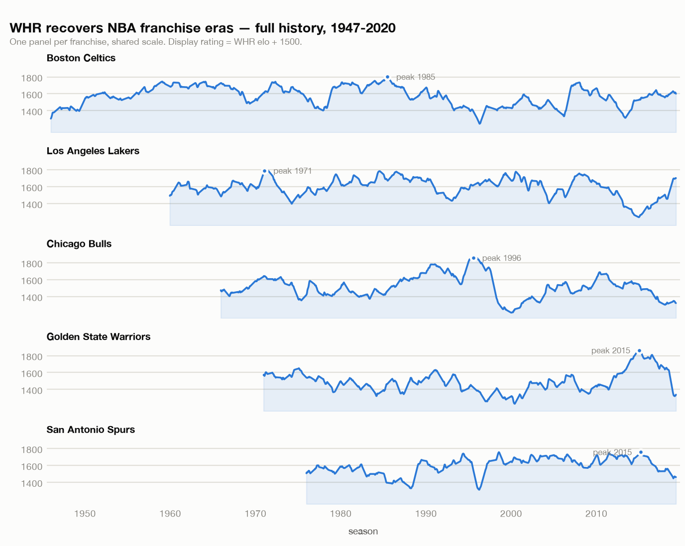
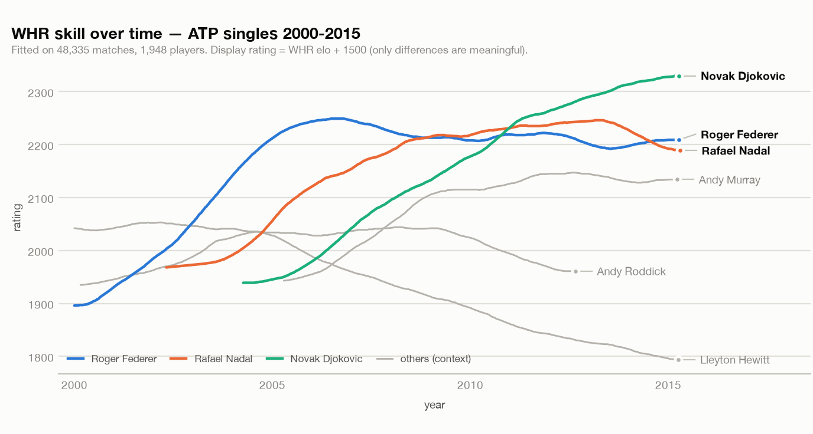

# WHR on real competition data — benchmark report

This report puts `whole-history-rating` (WHR) head-to-head with two well-known
dynamic rating systems — **by running them**, not by quoting their papers — on
the same data, under the same protocol, scored with the same metric. (Numbers
were first produced on 3.0.0 and re-verified bit-identical on 3.1.0, which made
komi opt-in — see §4.)

- **KickScore** (Maystre et al., *Pairwise Comparisons with Flexible
  Time-Dynamics*, KDD 2019) — NBA and football.
- **TrueSkill Through Time** (Landfried et al.) — the ATP tennis history.

WHR belongs to the same family as both: a Bayesian Bradley–Terry model whose
player strengths follow a Gaussian random walk in time. So the question is not
"is WHR a different idea" but "does this implementation actually perform against
the reference implementations on their own data". The answer is **it is
competitive but does not dominate**: it leads the three-outcome football
benchmark, trails KickScore on the NBA by 0.6% and TrueSkill Through Time on
tennis by 1.6%, and all three are beaten on the NBA by a domain-specific model
that sees rosters and injuries.

> **Reproducibility.** Every number below is produced by the scripts in this
> directory from data downloaded at runtime; see [`README.md`](README.md) for
> exact sources and commands. The head-to-head numbers come from
> [`versus.py`](versus.py), which fits all three systems itself, so a difference
> in data vintage or train/test split cannot explain any gap. They are **not**
> reproductions of the reference papers' published numbers, which use different
> splits and preprocessing. §5 lists the protocol decisions that are judgement
> calls.

---

## Headline

All three systems: same training prefix, same validation season for tuning, same
test season, same metric, same integer-day time unit.

| Benchmark | Test set | **WHR** | KickScore | TrueSkill Through Time | Leader |
|---|---|---|---|---|---|
| **NBA** 2018-19 | n=1312, 2-way | 0.666 / 63.6% | **0.662 / 63.9%** | 0.688 / 63.6% | KickScore, by 0.6% |
| **Tennis (ATP)** 2014 | n=2816, 2-way | 0.614 / **67.0%** | 0.606 / 66.4% | **0.604 / 66.6%** | TTT, by 1.6% |
| **Football** big-5 2022-23 | n=1826, 3-way | **1.009 / 51.5%** | 1.013 / 51.5% | 1.023 / 52.0% | **WHR**, by 0.4% |

Log-loss in nats (lower is better) / accuracy. Context on the same games: 538
RAPTOR scores **0.615 / 65.6%** and 538 Elo **0.619 / 65.3%** on the NBA test
set — both ahead of all three general-purpose systems. The naive home-rate
baseline scores 0.678, which TrueSkill Through Time fails to beat on log-loss
despite 63.6% accuracy.

Every reported optimum is interior to its hyper-parameter grid: grids were
widened and re-run until no `on_grid_edge` flag remained, so no system is quoted
at a value its grid merely failed to reach (see §5).

All fits converge (gradient ∞-norm ≈ 3–5·10⁻³) and recover historically correct
strength curves (see the NBA figure).

---

## 1. NBA — WHR vs KickScore vs TTT vs FiveThirtyEight

**Data.** FiveThirtyEight's complete NBA/BAA history — the exact `nba_elo.csv`
KickScore's NBA example uses — 69,377 games, 1947–2020, `team1` = home team.
Handily, the file carries FiveThirtyEight's *own* pre-game win probabilities
(Elo and RAPTOR), which we score as published baselines on the identical test
games.

**Setup.** 14-day time bins; home-court advantage modelled with a WHR handicap
key on the home team; `w2` chosen on 2017-18 (→ `w2 = 1000` elo²/bin) and
reported on the unseen **2018-19** season (n = 1312). "frozen" = fit at season
start; "online" = walk-forward, folding each game in as it is revealed (the fair
analogue of 538's per-game-updated Elo).

| Model | log-loss | accuracy |
|---|---|---|
| base rate (61.9% home) | 0.6783 | 59.1% |
| WHR, no home advantage | 0.6839 | 60.3% |
| WHR + home (frozen at season start) | 0.6699 | 63.6% |
| **WHR + home (online)** | **0.6343** | **64.3%** |
| FiveThirtyEight Elo (online) | 0.6192 | 65.3% |
| FiveThirtyEight RAPTOR (online) | 0.6152 | 65.6% |

**Head-to-head** (`versus.py nba`) — all three systems frozen at season start,
each tuned on 2018 over a two-axis grid, on the identical 1,312 games:

| Model | tuned params | log-loss | accuracy |
|---|---|---|---|
| 538 RAPTOR (published) | — | **0.6152** | 65.6% |
| 538 Elo (published) | — | 0.6192 | 65.3% |
| KickScore | `wiener_var=0.01`, `prior_var` flat | **0.6620** | 63.9% |
| WHR | `w2=1000`, `account_for_uncertainty=True` | 0.6660 | 63.6% |
| base rate (61.9% home) | — | 0.6777 | 59.1% |
| TrueSkill Through Time | `gamma=0.1`, `beta=0.5` | 0.6882 | 63.6% |

**Findings.**
- **KickScore edges WHR by 0.6%** (0.6620 vs 0.6660) on identical games and an
  identical frozen protocol. The gap was 0.0079 before WHR's predictions were
  allowed to integrate rating uncertainty and 0.0040 after — real, small, and
  robust across three independent re-runs.
- **TTT is last, and behind the naive baseline on log-loss** (0.6882 vs 0.6777)
  while matching WHR's 63.6% accuracy. Its optimum is interior to its grid, so
  this is not a tuning artefact: at `beta=0.5` it ranks teams as well as WHR and
  is badly calibrated about it.
- WHR **estimated the home-court advantage at +98 elo** purely from results —
  bang on the well-known NBA home edge (~+3 points ≈ +100 elo). The no-home
  ablation is *worse than the base rate* on log-loss, confirming how much of NBA
  predictability is home court, and that WHR's handicap machinery captures it.
- **538 beats all three general-purpose systems**, by 0.05 nats over the best of
  them. RAPTOR carries margin-of-victory, rest, travel and player-level roster
  features; the rating systems see only who beat whom, and when. This is the
  honest ceiling on what any of these libraries buys you as a forecaster.
- The frozen→online jump for WHR alone (0.670 → 0.634, table above) is a separate
  lesson: WHR is designed to be re-fit as data arrives, and the head-to-head's
  frozen protocol deliberately gives up that advantage for comparability.

**History recovered.** Fitting the full 1947–2020 history reproduces known NBA
eras — Celtics dominance in the late 50s/60s, the Bulls' 1996 peak, the Spurs'
Duncan-era plateau, and the Warriors' 2015-17 spike:



---

## 2. Tennis (ATP) — WHR vs KickScore vs TTT on TTT's own sport

**Data.** Jeff Sackmann's ATP match files, seasons 2000–2015 from a reachable
mirror: 48,335 main-tour singles matches, 1,948 players — the Federer / Nadal /
Djokovic / Roddick / Hewitt / Murray era. Time step = day index from
`tourney_date` (already tournament-granular). `w2` chosen on 2013 (→ `w2 = 3`
elo²/day; tennis skill is stable, so ratings should drift slowly) and reported
on the unseen **2014** season (n = 2816).

**No-leak orientation.** Training records each match winner→loser (the
Bradley–Terry datum). For the test set, matches are oriented by player id
(independent of the result) and we predict P(player-1 wins), so the outcome is
never leaked into the prediction.

**Head-to-head** (`versus.py tennis`) — trained on 2000–2013 (44,405 matches),
tuned on 2013, scored on 2014:

| Model | tuned params | log-loss | accuracy |
|---|---|---|---|
| TrueSkill Through Time | `gamma=0.3`, `beta=32` | **0.6043** | 66.6% |
| KickScore | `wiener_var=1e-5`, `prior_var=0.125` | 0.6057 | 66.4% |
| WHR | `w2=3`, `account_for_uncertainty=True` | 0.6141 | **67.0%** |
| coin flip (0.5) | — | 0.6931 | — |

**Findings.**
- **WHR is third on log-loss and first on accuracy.** It calls 67.0% of held-out
  2014 matches correctly — more than either competitor — while scoring 0.6141
  against TTT's 0.6043. The ordering it produces is the best of the three; the
  probabilities it attaches to that ordering are the worst.
- **TTT wins here, on its own sport, and only after its grid was opened up.** Its
  first sweep capped `beta` at 2.0 and returned 0.6201; extending the axis to 64
  moved it to 0.6043, with the optimum landing at `beta=32`. A benchmark that had
  frozen the competitors' scale parameters at their defaults would have reported
  WHR as the tennis winner, and would have been wrong.
- `account_for_uncertainty=True` was selected by the validation season and is
  worth 0.6164 → 0.6141. It closes about a fifth of the gap to TTT; the rest is
  not a calibration artefact.
- The fit spans ~1,950 players over 15 years and converges cleanly
  (gradient ∞-norm ≈ 5·10⁻³), demonstrating WHR at a realistic scale.
- Accuracy is not reported for the coin flip: at exactly p = 0.5 every prediction
  is a tie, so the figure would only record which way `argmax` breaks ties.

**History recovered.** The skill-over-time curves reproduce the era's story:
Hewitt and Roddick on top in the early 2000s, Federer's mid-decade peak, Nadal's
2005 breakout, and Djokovic climbing past the field to the top by 2011–2015:



---

## 3. Football — the Davidson draw model on real league data

**Data.** `openfootball/football.json`, big-five European leagues (England,
Spain, Germany, Italy, France) 2014-15…2023-24: 18,085 matches, 202 teams,
**25.2% draws** — the natural test for WHR 3.0.0's Davidson draw model. Weekly
bins; home advantage via a handicap key; `w2` chosen on 2021-22 (→ `w2 = 30`)
and reported on the unseen **2022-23** season (n = 1826).

**Head-to-head** (`versus.py football`) — every system predicting all three
outcomes, trained on 2014-15…2021-22, tuned on 2021-22, scored on 2022-23:

| Model | tuned params | 3-way log-loss | accuracy |
|---|---|---|---|
| **WHR (Davidson)** | `w2=30` | **1.0089** | 51.5% |
| KickScore (ternary) | `wiener_var=1e-4`, `margin=0.3` | 1.0134 | 51.5% |
| TrueSkill Through Time | `gamma=0.03`, `p_draw=0.30` | 1.0228 | **52.0%** |
| base rate (H/D/A frequencies) | — | 1.0630 | 45.7% |

WHR's own draw-blind ablation, for reference: Bradley–Terry with a constant draw
rate scores **1.0132 / 51.7%** — i.e. roughly KickScore's number, which is a
useful sanity check that the Davidson gain is the draw *model* and not the rest
of the pipeline.

**Findings.**
- **This is WHR's benchmark.** It leads both reference implementations on the
  three-outcome metric, and it does so with the *fewest* tuned parameters (one
  axis against their two). The margin is 0.4% over KickScore and 1.4% over TTT —
  small, but consistent across three independent re-runs, and unlike the
  two-outcome results it is not attributable to tuning depth.
- **It wins despite a handicap.** `win_draw_loss_probabilities` has no
  `account_for_uncertainty` parameter, so WHR's three-outcome predictions here
  are bare point estimates while both competitors fold their posterior variance
  in. The one lever that improved WHR on tennis and the NBA was unavailable on
  the sport it wins.
- WHR **estimated a global draw tendency ν ≈ 0.79** and a **home advantage of
  +80 elo** — both realistic for European football (home edge ≈ 0.3–0.4 goals).
- Both WHR variants beat the base rate decisively (log-loss 1.063 → 1.01,
  accuracy 45.7% → ~52%).
- **The Davidson model beats the "assume a constant draw rate" ablation on
  log-loss** (1.0089 vs 1.0132). The gain is real but modest, and it is a
  *calibration* gain, not an accuracy one: Davidson raises draw probability for
  evenly-matched sides, which sharpens the predicted distribution, but a draw is
  rarely the single most likely outcome (≈27% < home ≈45%), so top-1 accuracy
  barely moves. This is exactly the behaviour the model is supposed to have, and
  it is now confirmed against KickScore run locally rather than against its
  published figures.

---

## 4. Cross-cutting findings

**Where WHR stands.** It leads the three-outcome benchmark and trails on the two
two-outcome ones, always by a small margin. Nothing here suggests an
implementation defect — the model performs as the literature predicts — but
neither does it support a claim of superiority.

**The interesting result is not the ranking, it is the shape of the errors.** On
tennis WHR has the *best* accuracy of the three (67.0%) and the *worst* log-loss.
It orders players at least as well as its competitors and is simply too confident
about it. The mirror image appears on the NBA, where TrueSkill Through Time
matches WHR's 63.6% accuracy yet scores 0.688 — worse than the naive home-rate
baseline's 0.678. Both are calibration failures, not ranking failures, and they
have a concrete consequence: on a two-outcome sport, use
`account_for_uncertainty=True` (Coulom's `Predict`, which integrates the point
probability over the players' rating variances) whenever you consume the
probabilities rather than the ordering. Swept as a hyper-parameter, the
validation season chose it on both sports, worth 0.616 → 0.614 on tennis and
0.670 → 0.666 on the NBA. It is not reachable for three-outcome predictions:
`win_draw_loss_probabilities` has no such parameter, which is a genuine gap in
the library rather than a modelling choice.

**Where WHR's modelling actually wins.** Football is the one benchmark decided by
a modelling choice rather than by tuning. WHR fits a global draw tendency
(ν≈0.79) from the data under the Davidson model, and beats both KickScore's
ternary `margin` and TTT's `p_draw` band on identical matches. The margin is
small (0.4%) but the direction is consistent, and unlike the two-outcome results
it survives the fact that WHR's three-outcome predictions cannot be
uncertainty-corrected.

**Two things the exercise surfaced about the library:**

1. **`w2` is in elo² per time-step and the results are very sensitive to it.**
   The optimum differs by two orders of magnitude across sports (tennis ≈ 1,
   NBA ≈ 1000 per bin) because it must match how fast real skill drifts *and* the
   chosen time unit. This is correct behaviour, but it means **`w2` should be
   tuned per dataset** — `WHR.fit_w2()` exists for exactly this. A first run with
   a too-small `w2` produced predictions no better than the base rate.

2. **Two library issues these benchmarks surfaced — both now fixed upstream.**
   Originally every `create_game` carried WHR's default Go komi key `6.5`, which
   was *estimated* unless pinned (unlike the handicap-`0` key, which is
   auto-pinned). On these sports (no komi) that free global parameter is
   degenerate: it absorbed real skill signal, and the unclamped
   `math.exp(-grad / hess)` in `_newton_handicap_komi` raised
   `OverflowError: math range error`. These benchmarks originally worked around
   it with `pinned_komi={6.5: 0.0}`. Both root causes are now fixed in the
   library — the Newton step is trust-region clamped (**3.0.1**) and komi is
   **opt-in** with no silent default (**3.1.0**) — so the workaround is gone and
   the benchmarks simply pass no komi. Re-running them across that change
   produced **bit-identical** results, as expected: a komi pinned to 0 elo and
   no komi at all are mathematically the same thing.

---

## 5. Limitations

The head-to-head is only as fair as its protocol, and three decisions in it are
judgement calls rather than facts. Each was resolved the same way — pick the
option that does not privilege WHR — but a reader entitled to disagree should
know where.

1. **Cold starts.** ~4.5% of the tennis test matches involve a player absent from
   the training prefix. Each library answers those from its *own* prior: WHR
   treats an unknown player as an even (gamma = 1) reference, TTT falls back to
   `Gaussian(0, sigma)`, and KickScore needs its items declared up front, so the
   test-set names are registered with **no observations** (only the identity of
   who is playing is used; no test result is ever observed). An earlier version
   of this benchmark returned a hard-coded 0.5 for KickScore cold starts, which
   penalised it — fixing that moved its tennis log-loss materially.
2. **Home advantage** is expressed in each library's own idiom, not a common one:
   a fitted handicap category for WHR, an extra always-home item for
   KickScore/TTT. These are not identical parameterisations, and no single choice
   would be neutral.
3. **Convergence budget** is fixed per library (WHR `auto_iterate` to a gradient
   precision, KickScore `max_iter=100`, TTT `convergence(epsilon=1e-3)`), not
   matched on wall-clock. A speed comparison would need a different design; this
   benchmark measures predictive quality only.

Beyond the protocol:

- Not reproductions of the papers' published numbers. In particular the tennis
  window is 2000–2015 (a reachable mirror), not the full open era TTT used, and
  time is discretised into bins (14-day for NBA, weekly for football).
- Hyper-parameters are chosen on a single validation season, not by full
  cross-validation. Grids are geometric and were widened until every optimum was
  interior; where the objective is genuinely flat along an axis — KickScore's NBA
  `prior_var` scores 0.6547 at all six values — that is reported as a flat axis
  rather than chased.
- Test sets are one season each (1,312 to 2,816 matches). Differences of a few
  thousandths of a nat are within what a different season would reshuffle; the
  ordering claims here should be read as "close" rather than "settled".
- Frozen holdout throughout the head-to-head, for comparability. The separate
  [`nba.py`](nba.py) run adds an online walk-forward variant, which suits WHR.
- Multi-league football pools disconnected rating pools in one instance
  (leagues don't play each other); predictions are within-league, which is all
  the test evaluates.

## 6. Reproduce

The head-to-head — fits WHR, KickScore and TTT itself, one dataset per
invocation:

```bash
uv run --with pandas --with kickscore --with TrueSkillThroughTime python benchmarks/versus.py tennis
```

Swap `tennis` for `nba` or `football`. The WHR-only benchmarks (which add the
online walk-forward, the calibration curves and the draw-blind ablation):

```bash
uv run --with pandas --with matplotlib python benchmarks/nba.py
uv run --with pandas --with matplotlib python benchmarks/tennis.py
uv run --with pandas python benchmarks/football.py
```

And the README figures, from the JSON the runs above leave behind:

```bash
uv run --with matplotlib python benchmarks/make_figures.py
```

Head-to-head metrics are written to `results/versus_*.json`, WHR-only metrics to
`results/*_results.json`, and run logs to `results/*.log`. Each model entry
records the selected hyper-parameters, its validation loss, the grid size, and
the `on_grid_edge` / `flat_axes` diagnostics.
